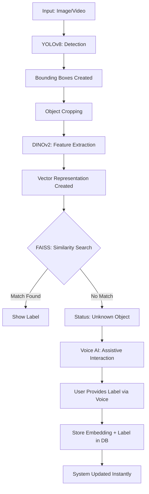

<<<<<<< HEAD
# CodeNova Adaptive Vision Prototype

This is a complete end-to-end Python prototype for an adaptive object detection system that does NOT require retraining to add new objects.

## Architecture
1. **Object Detection**: YOLOv8 (ultralytics) for localization.
2. **Feature Extraction**: DINOv2 (HuggingFace transformers) for embedding generation.
3. **Search Engine**: FAISS for efficient similarity search.
4. **Adaptive Learning**: Dynamic database updates without retraining.
5. **UI**: Streamlit-based interactive dashboard.
6. **Voice**: Speech notifications for detected objects.

## Project Structure
- `app.py`: Streamlit User Interface and main application logic.
- `detect.py`: YOLOv8 detection and image cropping module.
- `embed.py`: DINOv2 embedding generation using HuggingFace.
- `database.py`: FAISS-based vector database management.
- `learn.py`: Logic for adding new objects to the knowledge base.
- `voice.py`: Text-to-speech assistant.
- `data/`: Directory containing vectors and labels.

## Installation
Ensure you have the required dependencies installed:
```bash
pip install -r requirements.txt
```

## How to Run
Launch the Streamlit application:
```bash
streamlit run app.py
```

## Usage
1. **Detection**: Upload an image. The system will detect objects and highlight them.
2. **Identification**: Recognized objects will be labeled. Unrecognized ones will be marked as "Unknown".
3. **Learning**: For "Unknown" objects, enter a label name in the sidebar and click "Add to Database". The system now knows that object!
4. **Voice**: Enable/disable speech notifications to hear the names of detected objects.
=======
# 🛡️ CodeNova: Adaptive Object Recognition System

### *Empowering Vision with Dynamic Real-Time Learning*

[](#architecture)
[](#license)
[](#tech-stack)

---

## 🚀 The Vision

Traditional object detection systems require **expensive retraining** or **fine-tuning** every time a new object needs to be recognized. This project breaks that barrier.

By combining **State-of-the-Art Object Detection (YOLOv8)** with **Foundation Model Embeddings (DINOv2)** and **Sub-millisecond Vector Retrieval (FAISS)**, we've built a system that learns new objects through a simple conversation—**zero retraining required**.

---

## 🛠️ System Architecture

Our architecture follows a modular, dual-stage pipeline that separates *Localization* from *Identification*.



---

## ✨ Key Features

- **🧠 Open-World Recognition**: Add new objects dynamically without touching a single line of training code.
- **⚡ Industrial Performance**: YOLOv8 ensures lighting-fast detection, while FAISS handles millions of vectors in microseconds.
- **👁️ Semantic Visual Features**: DINOv2 provides extremely robust feature vectors that work across different lighting and angles.
- **🎙️ Voice-Activated Learning**: A human-in-the-loop mechanism where the system "asks" for labels and learns them on the fly.
- **📈 Scalable Storage**: New knowledge is stored as vector embeddings in a queryable database, making the system smarter with every interaction.

---

## 🏗️ Technical Implementation

### 1. Detection (YOLOv8)
Locates objects in the frame and provides precise bounding boxes. It acts as the "eyes" that find *where* the objects are.

### 2. Feature Extraction (DINOv2)
Crops are passed through Meta’s DINOv2. Unlike traditional CNNs, DINOv2 produces highly descriptive semantic embeddings that capture the essence of an object even from a single example.

### 3. Retrieval (FAISS)
The extracted vector is compared against a pre-populated index.
- **Distance Metric**: L2 or Inner Product (Cosine Similarity).
- **Thresholding**: If the distance > threshold, the object is flagged as "Unknown".

### 4. Dynamic Update (Voice + DB)
When an unknown object is detected:
1.  **Speech-to-Text**: Captures user input (e.g., "This is a specialized lab tool").
2.  **Vector Persistence**: The embedding and label are stored.
3.  **Instant Retrieval**: The next time the object appears, FAISS will find it immediately.

---

## 📂 Project Structure

```text
CodeNova/
├── models/             # YOLOv8 & DINOv2 checkpoints
├── src/
│   ├── detector.py     # YOLO logic
│   ├── embedder.py     # DINOv2 feature extraction
│   ├── search.py       # FAISS indexing/search
│   ├── voice.py        # Voice interaction module
│   └── database.py     # Vector storage & management
├── data/               # Local vector storage
├── main.py             # Main execution entry point
└── requirements.txt    # Project dependencies
```

---

## 🚥 Getting Started

### Prerequisites
- Python 3.9+
- CUDA-enabled GPU (Recommended)

### Installation

1. Clone the repository:
   ```bash
   git clone https://github.com/yourusername/codenova.git
   cd codenova
   ```

2. Install dependencies:
   ```bash
   pip install -r requirements.txt
   ```

3. Run the system:
   ```bash
   python main.py
   ```

---

## 🔮 Future Roadmap

- [ ] Integration with **Segment Anything Model (SAM)** for pixel-perfect cropping.
- [ ] Cloud-sync for vector databases across multiple edge devices.
- [ ] Support for **Multimodal LLMs** to automatically describe unknown objects.

---

## 🤝 Contributing

Contributions are what make the open-source community an amazing place to learn, inspire, and create. Any contributions you make are **greatly appreciated**.

1. Fork the Project
2. Create your Feature Branch (`git checkout -b feature/AmazingFeature`)
3. Commit your Changes (`git commit -m 'Add some AmazingFeature'`)
4. Push to the Branch (`git push origin feature/AmazingFeature`)
5. Open a Pull Request

---

>>>>>>> e845c19a8e037531d8ef3a5371bc762f47f47bab
