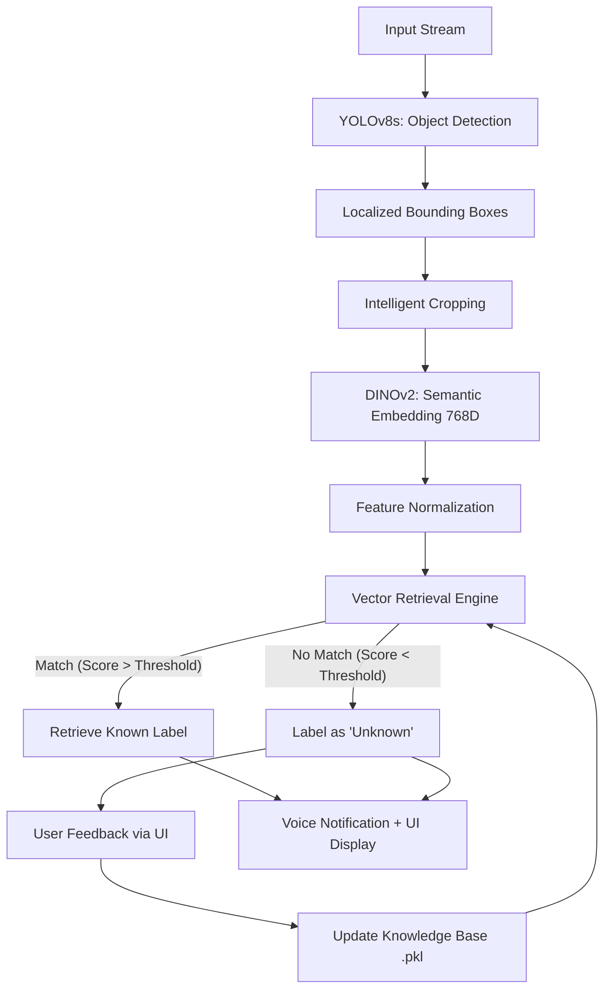

# 🛡️ CodeNova: AI-First Adaptive Vision System

### *Real-Time Zero-Shot Object Recognition with Quantum-Hybrid Intelligence*

[](#architecture)
[](#license)
[](#tech-stack)
[](#tech-stack)

---

## 🚀 Overview

**CodeNova** is an adaptive computer vision platform that breaks the traditional "train-then-deploy" cycle. Instead of retraining models to learn new objects, CodeNova uses a **Zero-Shot Learning** approach. It combines high-speed object detection with state-of-the-art semantic embedding and a retrieval-augmented database to learn new objects through simple user interaction in real-time.

### Problem-statement fit (open-set extension)

Many briefs ask for a detector that can **add new object categories after deployment** without **full model retraining** (and without fine-tuning or transfer learning on the base detector). CodeNova satisfies that as follows:

| Requirement | What we do |
|-------------|------------|
| Base detection | **YOLOv8** stays **frozen** (fixed weights, COCO-style proposals). |
| Add object *a* later | User labels an **UNKNOWN** crop in **Image lab** → we store a **DINOv2 embedding** + name in `data/database.pkl`. |
| No detector retrain | We never run backprop / fine-tune on YOLO; only the **embedding memory** grows. |
| Immediate use | **Live cam** and the next **Image lab** run retrieve the new label by **similarity**. |

**Pitch:** *Same frozen “eyes” (boxes), extensible “memory” (embeddings)—not a new training run.*

---

## 🏗️ System Architecture

Our engine follows a modular, three-stage "Sense-Understand-Recall" pipeline.



### 1. Localization (The "Eyes")
We use **YOLOv8s** (Ultralytics) to identify where objects are in the frame. This provides the spatial coordinates (bounding boxes) needed for precise cropping.

### 2. Semantic Understanding (The "Brain")
Each detected object is passed through **Meta's DINOv2 (base)**. DINOv2 transforms raw pixels into a 768-dimensional mathematical representation (embedding) that captures the "essence" of the object, regardless of lighting or angle.

### 3. Retrieval & Learning (The "Memory")
CodeNova uses a high-performance vector database (`database.pkl`).
- **Inference**: Every detected object is compared against the database using **Cosine Similarity**.
- **Quantum Enhancement**: Optionally integrates a **4-qubit PennyLane circuit** for hybrid similarity scoring.
- **Learning**: If an object is unknown, specific embeddings can be saved with a label immediately, updating the "brain" without a single line of code.

---

## ✨ Key Features

- **🧠 Zero-Shot Recognition**: Teach the system a "Chair" or "Coffee Mug" once, and it remembers it forever.
- **⚡ Industrial Performance**: Optimized for real-time inference on CPU/GPU.
- **🎙️ Voice Integration**: Uses a non-blocking TTS engine to announce detected objects.
- **🎨 Modern Glassmorphism UI**: A premium Streamlit interface featuring dark mode, blur effects, and real-time confidence bars.
- **⚛️ Quantum-Hybrid Scoring**: Incorporates Pennylane for advanced feature similarity matching (Switchable).
- **🛡️ Factory Reset**: Safe mechanism to clear known classes and start fresh.

---

## 🛠️ Technology Stack

| Component | Technology | Role |
|---|---|---|
| **Frontend** | Streamlit | Responsive Web UI |
| **Detection** | YOLOv8s | Spatial Localization |
| **Embeddings** | DINOv2 (Vision Transformer) | Semantic Feature Extraction |
| **Vector DB** | FAISS / Pickle | High-speed retrieval & persistence |
| **Quantum ML** | PennyLane | Hybrid similarity engine |
| **Audio** | Pyttsx3 | Background Voice Assistant |
| **Backend** | Python / OpenCV | Glue logic and Image Processing |

---

## 🚥 Getting Started

### 1. Installation

Clone the repository and install dependencies:
```bash
git clone https://github.com/yourusername/codenova.git
cd codenova
pip install -r requirements.txt
```

### 2. Automatic Setup
Download sample datasets and build the initial vector index:
```bash
python auto_setup.py
```

### 3. Launch the System
Start the main application:
```bash
streamlit run app.py
```

---

## 📂 Project Structure

- `app.py`: Main Streamlit application and UI logic.
- `detect.py`: YOLOv8 wrapper for localization.
- `embed.py`: DINOv2 interface for feature extraction.
- `database.py`: Vector storage and hybrid similarity logic.
- `voice.py`: Non-blocking text-to-speech engine.
- `src/quantum_similarity.py`: Quantum circuit implementation.
- `data/`: Contains persisted embeddings (`database.pkl`).

---

## ⚛️ Quantum Enhancement Details

The system includes an experimental PennyLane-powered circuit that projects semantic vectors into a Hilbert space for comparison:
1. **Normalization**: Vectors are L2-normalized.
2. **PCA**: Compressed from 768D → 4D.
3. **Angle Encoding**: Data is encoded using RZ/RY gates.
4. **Adjoint Comparison**: Overlap between query and database vectors is measured.

---

## 📄 License
This project is licensed under the MIT License - see the LICENSE file for details.
